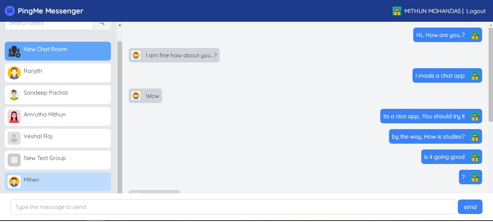

# Project Overview

This is a sample project created by Mithun Mohandas. Its a collaboration of React with Typescript, Tailwind CSS and Vite.

Key Features : 
➔ Responsive Design: Ensures a consistent experience across devices and screen sizes.

# Getting Started
To get the project up and running on your local machine, follow these steps:

Prerequisites : Node.js and npm installed on your system.

Installation : Clone the repository: git clone https://github.com/mithunmohandas2/PingMeMessenger-UI.git
Navigate to the project directory: cd PingMeMessenger-UI
Install dependencies: npm install 
Start the development server: npm run dev

Usage : Once the development server is running, access the dashboard in your browser at http://localhost:5173. Explore the various features and functionalities available within the dashboard interface.

# Acknowledgements
Special thanks to "Snive.io" for giving the opportunity to work on this project and showcase my React based development skills.

## Contact 
For detailed enquiries: Ph: +91 8075468241

 
   
  
<!--    -->
  
  
 

